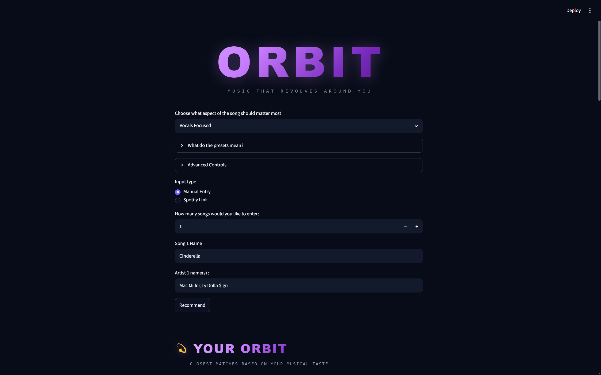
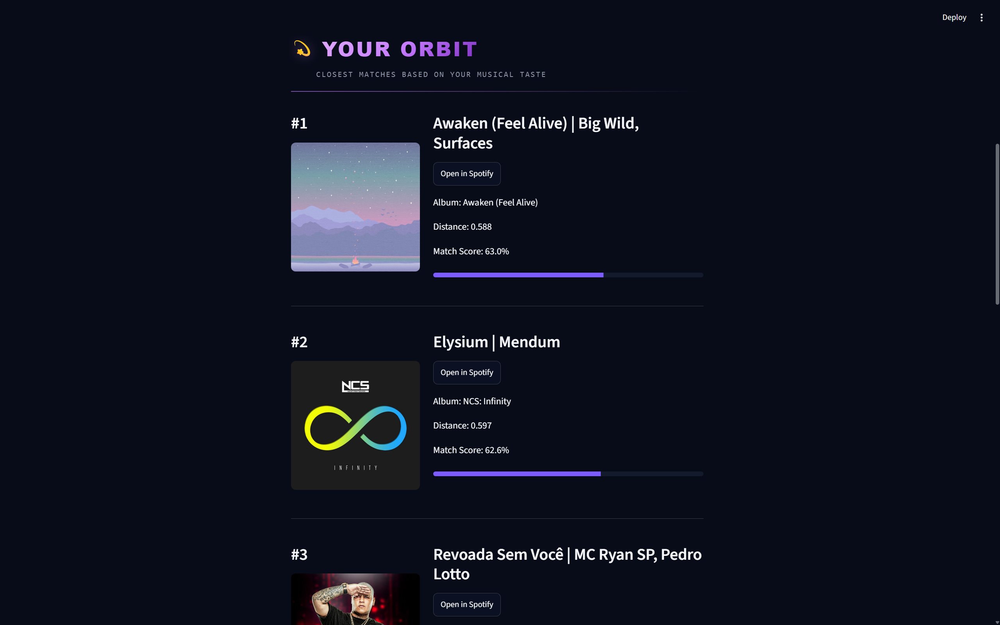
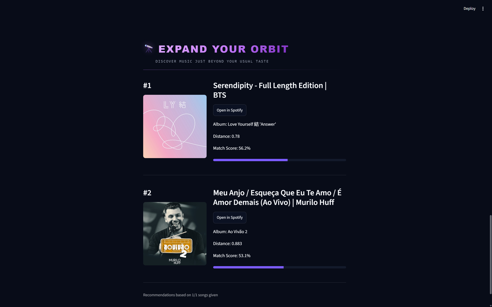

# Orbit
> Music That Revolves Around You

A machine learning powered music recommendation web application that generates personalised recommendations from Spotify songs and playlists

Orbit combines **K-Means clustering** and **K-Nearest Neighbours (KNN)** to deliver two modes:
- **Your Orbit** - highly similar songs based on existing taste and recommendation preference
- **Expand Your Orbit** - recommendations from neighbouring musical regions to encourage discovery while remaining stylistically relevant

Built using **Python**, **scikit-learn**, **pandas**, **Streamlit**, **Spotipy**, and the **Spotify Web API**.

## Demo
Landing Page

Your Orbit Songs

Expand Your Orbit Songs

