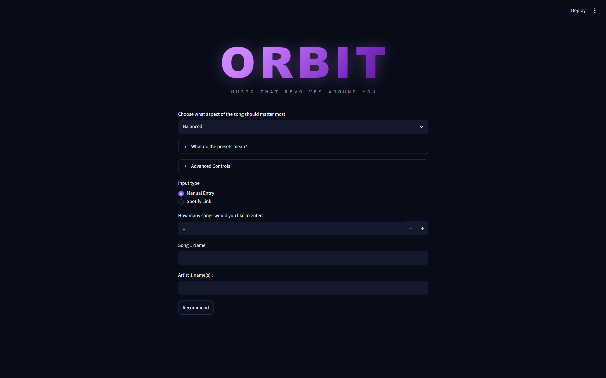
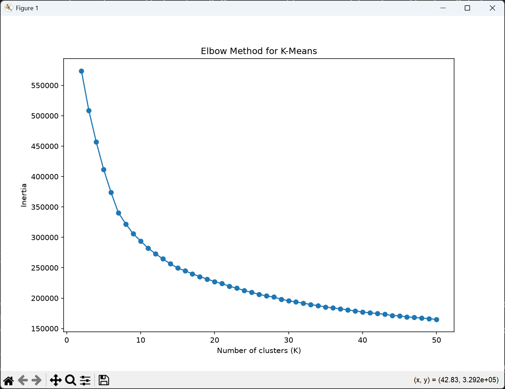
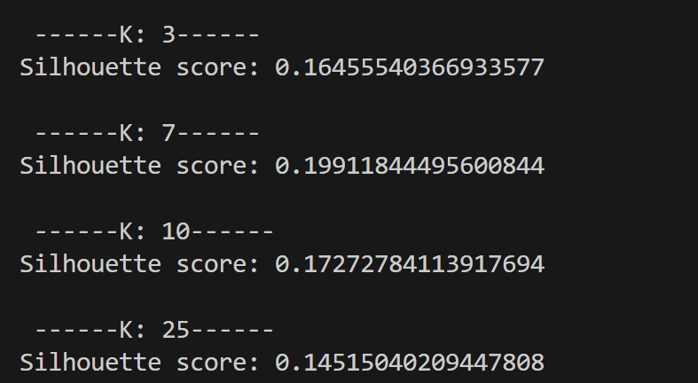

        

            ORBIT
        

        

            MUSIC THAT REVOLVES AROUND YOU
        

    

Orbit is a machine learning-powered music recommendation web application that helps users discover songs they are likely to enjoy while balancing familiarity with musical exploration.

Unlike a standard nearest-neighbour recommender, Orbit first organises songs into musical regions using K-Means clustering before applying K-nearest neighbour (KNN) search to deliver fast, personalised recommendations while also encouraging music discovery.

Orbit combines **K-Means clustering** and **K-Nearest Neighbours (KNN)** to deliver two complementary recommendation modes:
- **Your Orbit** - highly similar songs based on existing taste and recommendation preference
- **Expand Your Orbit** - recommendations from the closest neighbouring musical region to encourage discovery while remaining stylistically relevant

Built using **Python**, **scikit-learn**, **pandas**, **Streamlit**, **Spotipy**, and the **Spotify Web API**.

## Contents

- [Motivation](#motivation)
- [Features](#features)
- [How Orbit Works](#how-orbit-works)
  - [Data Preparation](#1-data-preparation)
  - [Query Representation](#2-query-representation)
  - [Feature Weighting](#3-feature-weighting)
  - [Recommendation Pipeline](#4-recommendation-pipeline)
- [Evaluation & Design Decisions](#evaluation--design-decisions)
- Results
- Installation
- Future Improvements

## Application Preview
### Landing Page
Users can enter songs manually, paste Spotify track links, or provide an accessible playlist link. Recommendation presets and advanced feature controls allow the similarity metric to be customised.

### Your Orbit Songs
High-confidence recommendations generated by applying weighted KNN search within the closest musical cluster.

### Expand Your Orbit Songs
Controlled exploration recommendations generated from the closest neighbouring musical cluster to encourage music discovery while remaining stylistically similar.

## Motivation
I have always enjoyed discovering new music and exploring artists, genres and sounds outside my typical listening habits. Spotify's discovery features, especially DJ X, are useful and a tool I utilise quite often but they became too repetitive. For me, it returned songs and artists that were too mainstream and already familiar to me.

I built Orbit to investigate where I could create a recommendation system that remained closely aligned with a listener's taste while also encouraging more deliberate music discovery. By allowing the user to specify and  dictate what they value in a song and how their recommendations should be tailored, Orbit was able to suggest unexpected cross-genre and cross-language recommendations that I would not normally encounter through mainstream recommendation feeds. Rather than relying on popularity, listening-history data or Spotify’s own recommendation engine, Orbit compares songs using audio characteristics such as energy, danceability, acousticness, valence and tempo. During early testing, the smaller independent dataset often produced unexpected cross-genre and cross-language recommendations that I would not normally encounter through mainstream recommendation feeds.

The 80,000 song dataset that I initially thought would be a limitation became part of the project's identity: instead of trying to produce Spotify at a smaller scale, Orbit aims to balance **familiarity and exploration**. That idea eventually became the two-part recommendation system:
- **Your Orbit** — high-confidence recommendations close to the listener’s current taste.
- **Expand Your Orbit** — controlled exploration into the nearest neighbouring musical region.

## Features

### Recommendation Engine
- Song recommendations from manual song and artist input
- Spotify track URL support
- Spotify playlist URL support
- Weighted feature similarity
- Recommendation presets
- Exploitation and exploration recommendation modes

### Machine Learning
- K-Means clustering
- K-Nearest Neighbours (KNN)
- Playlist embeddings
- User-defined feature weighting
- Runtime optimisation through clustered searches

### User Experience
- Interactive Streamlit web application
- Spotify album artwork
- Direct Spotify links
- Match score
- Robust error handling

## How Orbit Works
    User Input
            │
            ▼
    Spotify URL / Song Name
            │
            ▼
    Retrieve Songs From Dataset
            │
            ▼
    Extract Audio Features
            │
            ▼
    Average Query Vector
            │
            ▼
    Apply User Weights
            │
            ▼
    Find Closest K-Means Centroids
            │
     ┌──────┴────────┐
     ▼               ▼
    Nearest       Second Nearest
    Cluster         Cluster
    │               │
    ▼               ▼
    KNN             KNN
    │               │
    ▼               ▼
    Your Orbit   Expand Your Orbit

### 1. Data Preparation
Orbit is built upon a dataset containing approximately 114,000 Spotify tracks together with their associated audio features.
Before any recommendation could be generated, the dataset required preprocessing to improve data quality and ensure that distance calculations were meaningful.

#### Duplicate Removal
The original dataset contained a large number of duplicate songs. 
Initially, duplicates were removed using only the Spotify track ID. During testing, however, I discovered that this was insufficient because some songs appeared multiple times with different track IDs despite representing the same recording. 
To address this, duplicate songs were also removed based on an identical combination of **track name** and **artist(s)**, reducing the dataset to approximately **80,000 unique songs**.
This ensured recommendations were more diverse and prevented the same song appearing multiple times in the nearest neighbours. 

#### Similarity Features
Rather than comparing songs using metadata such as genre or popularity, Orbit measures similarity using Spotify's numerical audio characteristics.

The final feature set consists of:
- Danceability
- Energy
- Loudness
- Speechiness
- Acousticness
- Instrumentalness
- Liveness
- Valence 
- Tempo

These attributes were chosen because they describe how a song sounds rather than how popular it is, allowing recommendations to generalise across genres and languages.

#### Feature Scaling
Since recommendation quality depends on Euclidean distance, all similarity features were standardised before training. 
I chose standardisation rather than min-max normalisation because several features contained noticeable outliers. Standardisation preserves meaningful variation while preventing features with larger numberical ranges from dominating distance calculations. 

    After preprocessing, every song in the dataset was represented as a nine-dimensional feature vector. These vectors form the foundation of Orbit's recommendation pipeline.

### 2. Query Representation
Unlike many recommendation systems that only accept a single song, Orbit allows users to build recommendations from multiples songs or entire Spotify playlists. This would allow the user to receive song recommendations that better matched the vibe of a song they were achieving to get. 

The challenge therefore becomes representing multiples songs as a single query that can be compared against every song in the dataset. 

#### Song Representation
After preprocessing, every song is represented as a nine-dimensional feature vector containing its standardised Spotify audio features. When a user enters a single song, Orbit simply retrieves its corresponding feature vector from the dataset and uses it as the query representation.

#### Playlist Embeddings
Supporting Spotify playlist recommendations required a way of representing multiple songs as a single query. For every valid song contained within the playlist, Orbit retrieves its feature vector and computes the mean across every audio feature. This average vector acts as a playlist embedding, representing the overall musical characteristics of the playlist rather than any individual song. Recommendations are then generated by finding songs whose feature vectors are closest to this averaged representation.

#### Handling Missing Songs
Since the dataset is significantly smaller than Spotify's catalogue, some user-entered songs may not exist locally.Rather than terminating the recommendation process, Orbit simply ignores songs that are unavailable in the dataset and constructs the query using every remaining valid song. Only if no valid songs are found does the recommendation process terminate and return an informative error message.

    The resulting query vector is then passed into Orbit's recommendation pipeline, where user-defined feature weighting and clustered nearest-neighbour search are applied.

### 3. Feature Weighting
Every listener has their own different interpretation of what makes two songs ***feel similar***
For one user, **energy** and **tempo** may be the defining characteristics of a recommendation, whereas another listener may care far more about **acousticness** or **danceability**.

Using equal weighting across every audio feature assumes that every aspect of a song contributes equally to similarity, which is rarely the case in practice. 

To address this, Orbit allows users to customise the importance of each similarity feature through **adjustable weighting controls**. Though, I later realised that many users will be hesitant as to how they should optimise the weighting for their desired vibe and so later introduced **presets**.

#### How Weighting Works
A common misconception, one that I myself was guilty of initially, is that increasing the weight of a feature causes Orbit to recommend songs with *more* of that characteristic; this is not how the weighting system operates. 

Instead, increasing a feature's weight makes Orbit place greater importance on matching that characteristic **relative to the query itself**.

In other words, feature weighting changes **how similarity is measured**, rather than specifying which characteristics recommendations should possess.

#### Recommendation Presets
While manually adjusting every feature provides maximum flexibility, testing showed that most users preferred simpler controls. 

Orbit therefore includes several predefined recommendation presets, each applying a carefully selected set of feature weights to emphasise different listening preferences while avoiding the need for manual tuning.

Users can, however, still override these presets through the **advanced settings** when more precise control is desired. 

#### Implementation
Feature weighting is applied before similarity search by scaling both the query representation and every song vector. This ensures that weighted Euclidean distance naturally places greater emphasis on the selected audio characteristics during nearest-neighbour search.

### 4. Recommendation Pipeline

The first implementation of Orbit used a standard K-Nearest Neighbours (KNN) recommender, performing similarity search across every song in the dataset.

With approximately **80,000 songs**, this approach produced recommendations quickly enough for practical use. However, I realised that recommendation systems should be designed with scalability in mind. If the dataset were expanded to hundreds of thousands or even millions of songs, performing KNN across every song for every recommendation request would become increasingly inefficient.

Rather than waiting for this limitation to become a bottleneck, I redesigned the recommendation pipeline with two primary objectives:

- Generate recommendations that remain highly relevant to the user's existing musical taste
- Scale efficiently as the dataset grows without unnecessarily increasing recommendation time

To achieve this, Orbit combines **K-Means clustering** with **K-Nearest Neighbours (KNN)**. Rather than performing nearest-neighbour search across the entire dataset, Orbit first identifies the most relevant musical region before applying KNN within that smaller search space. This substantially reduces the number of distance calculations required while aiming to preserve recommendation quality.

#### K-Means Clustering
K-Means clustering partitions the dataset into groups of songs with similar audio characteristics.
Each cluster is represented by a centroid, which acts as the average position of every song assigned to that cluster within the feature space.
When a recommendation request is made, Orbit first determines which cluster best represents the user's query before performing any nearest-neighbour search.

#### Finding the Nearest Cluster

After constructing the weighted query vector, Orbit computes the Euclidean distance between the query and every cluster centroid.
The nearest centroid identifies the musical region most representative of the user's listening preferences.
Restricting similarity search to this cluster dramatically reduces the number of candidate songs while maintaining recommendation relevance.

#### KNN
Once the nearest cluster has been identified, Orbit performs K-Nearest Neighbours search using only the songs contained within that cluster.
Similarity is measured using weighted Euclidean distance across the selected Spotify audio features.
Searching within a smaller subset of musically similar songs significantly improves speed-efficiency compared to searching the entire dataset.

#### Exploration Recommendation
To balance familiarity with exploration, Orbit also identifies the second-closest cluster.
The nearest songs from this neighbouring musical region form the **Expand Your Orbit** recommendations.
This introduces new artists and styles that remain close to the user's existing preferences without feeling completely unrelated. It helps bridge the user to possibly new style and/or artists that they may not have listened to before.

## Evaluation & Design Decisions
### Selecting the Number of Clusters
Introducing K-Means clustering required determining an appropriate value for k.

Choosing too few clusters would create broad musical regions, reducing recommendation specificity. On the other hand, selecting too many clusters would fragment the dataset into very small groups, limiting the songs available for nearest-neighbour search

To investigate this trade-off, I evaluated several values of k using three techniques:

- Elbow Method
- Silhouette Score
- Principal Component Analysis (PCA)

Rather than relying on a single metric, the final choice was based on balancing cluster quality, visual separation and recommendation behaviour

### Elbow Method
The elbow method was used to identify the point at which increasing the number of clusters produced diminishing reductions in cluster variance. 
This provided an initial estimate for an appropriate range of values for **k**, rather than a single definitive answer.

**Figure 1** - Elbow curve used to estimate the initial range for k

### Silhouette Score
Silhouette analysis measures how well each song fits within its assigned cluster compared with neighbouring clusters. Higher silhouette scores indicate better-separated clusters but recommendation quality must also be taken into consideration alongside this metric.

**Figure 2** - Silhouette Score for varying k values

### PCA Visualisations
Because clustering occurs in a nine-dimensional feature space, direct visual inspection is impossible.
Principal Component Analysis (PCA) was therefore used to project songs into two dimensions, allowing the overall cluster structure to be inspected visually.

Although PCA inevitably loses information during projection, it provided useful qualitative evidence that the selected value of **k** produced distinct musical regions without excessive fragmentation.