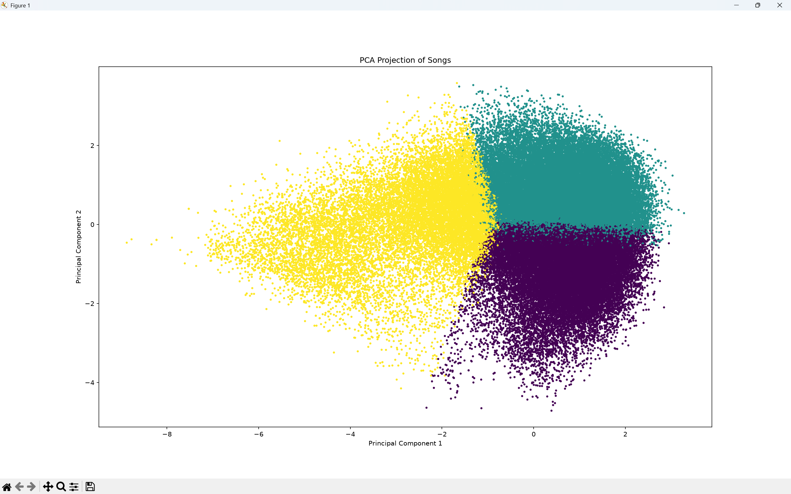
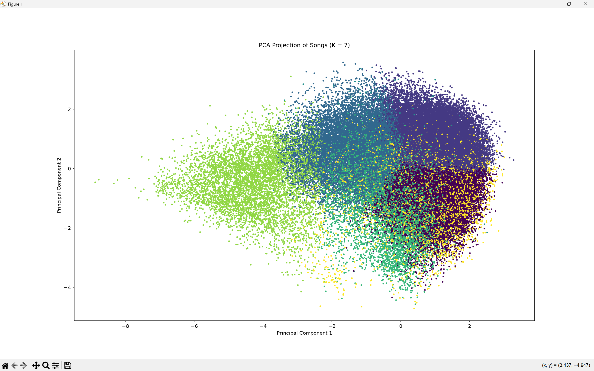
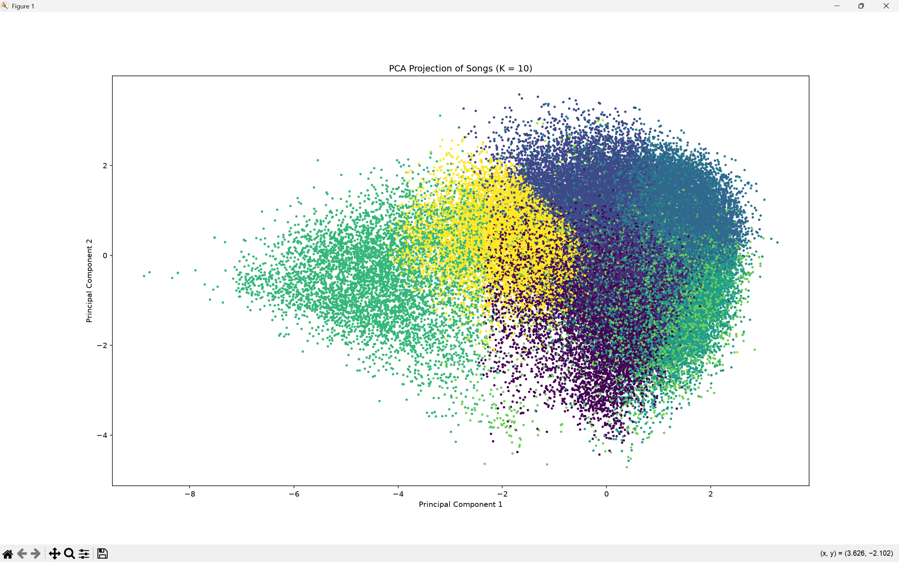
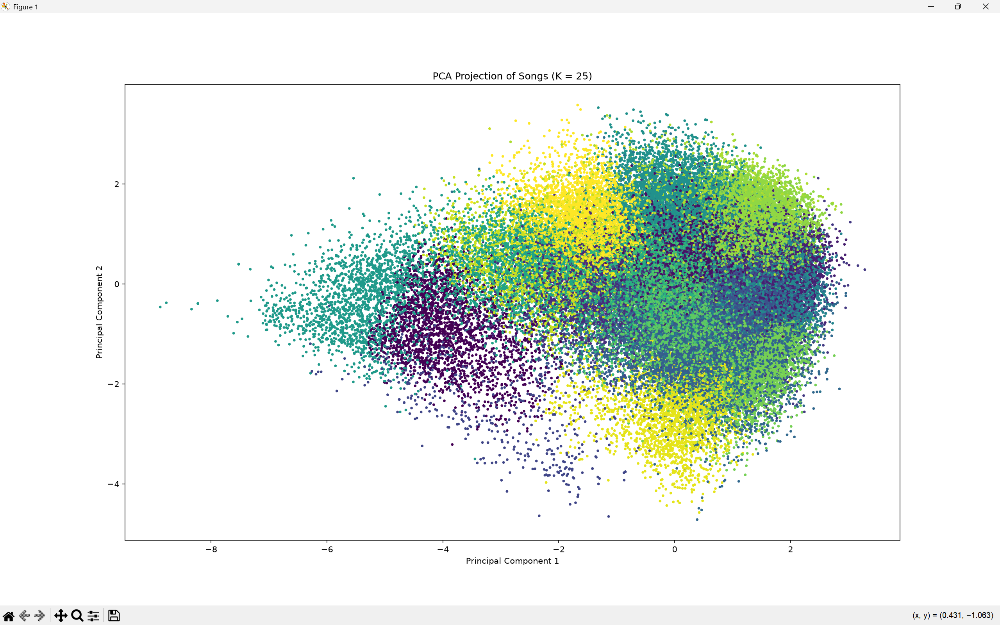
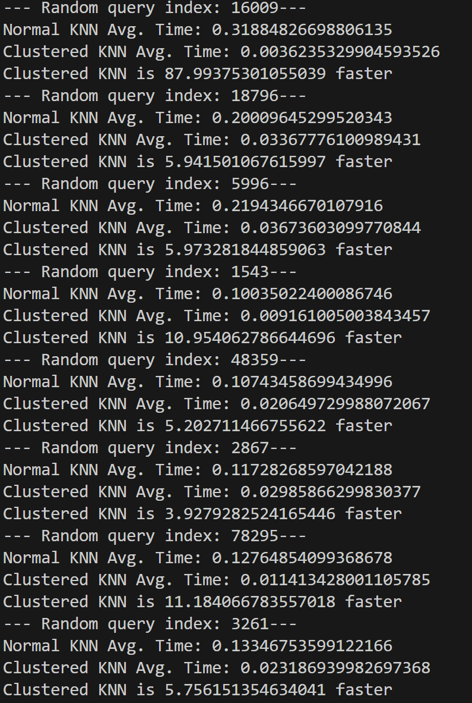
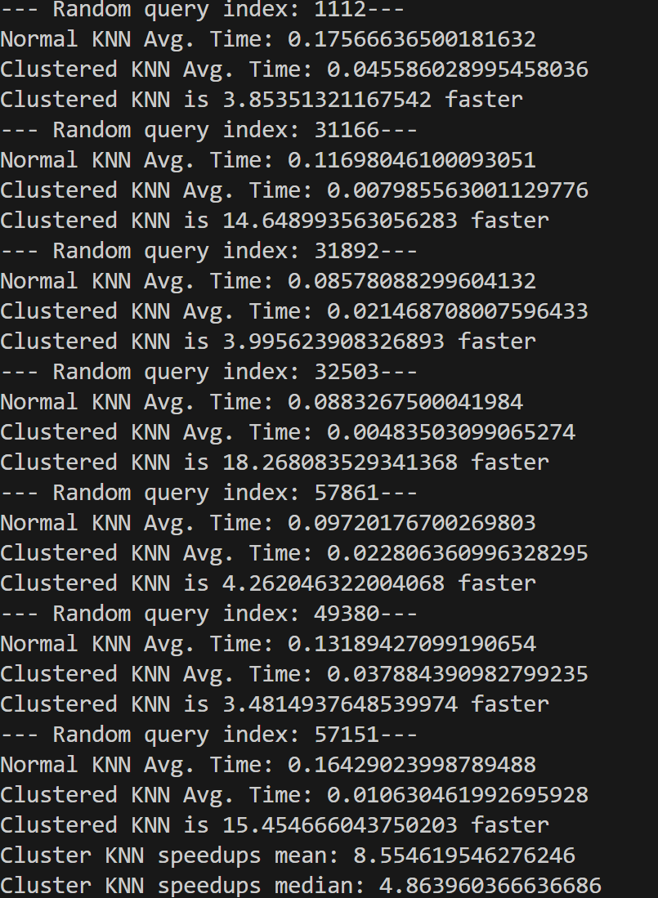
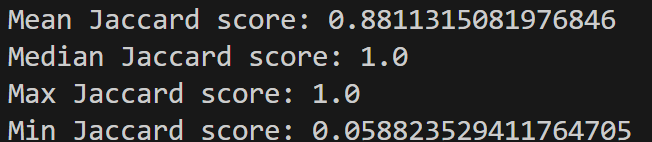

<p align="center">
  
</p>

**Live Demo:** https://orbitml.streamlit.app

Orbit is a machine learning-powered music recommendation web application that helps users discover songs they are likely to enjoy while balancing familiarity with musical exploration.

Unlike a standard nearest-neighbour recommender, Orbit first organises songs into musical regions using K-Means clustering before applying K-nearest neighbour (KNN) search to deliver fast, personalised recommendations while also encouraging music discovery.

Orbit combines **K-Means clustering** and **K-Nearest Neighbours (KNN)** to deliver two complementary recommendation modes:
- **Your Orbit** - highly similar songs based on existing taste and recommendation preference
- **Expand Your Orbit** - recommendations from the closest neighbouring musical region to encourage discovery while remaining stylistically relevant

Built using **Python**, **scikit-learn**, **pandas**, **Streamlit**, **Spotipy**, and the **Spotify Web API**.

## Contents

- [Application Preview](#application-preview)
- [Motivation](#motivation)
- [Features](#features)
- [How Orbit Works](#how-orbit-works)
  - [Data Preparation](#1-data-preparation)
  - [Query Representation](#2-query-representation)
  - [Feature Weighting](#3-feature-weighting)
  - [Recommendation Pipeline](#4-recommendation-pipeline)
- [Evaluation & Design Decisions](#evaluation--design-decisions)
- [Results](#results)
- [Future Improvements](#future-improvements)
- [Installation](#installation)


## Application Preview
A short demonstration of Orbit's end-to-end recommendation workflow.


## Motivation
I have always enjoyed discovering new music and exploring artists, genres and sounds outside my typical listening habits. Spotify's discovery features, especially DJ X, are useful and a tool I utilise quite often but they became too repetitive. For me, it returned songs and artists that were too mainstream and already familiar to me.

I built Orbit to investigate whether I could create a recommendation system that remained closely aligned with a listener's taste while also encouraging more deliberate music discovery. Rather than relying on popularity, listening-history data or Spotify’s own recommendation engine, Orbit compares songs using audio characteristics such as energy, danceability, acousticness, valence and tempo. By allowing the user to specify and  dictate what they value in a song and how their recommendations should be tailored, during early testing, the smaller independent dataset often produced unexpected cross-genre and cross-language recommendations that I would not normally encounter through mainstream recommendation feeds.

The 80,000 song dataset that I initially thought would be a limitation became part of the project's identity: instead of trying to produce Spotify at a smaller scale, Orbit aims to balance **familiarity and exploration**. That idea eventually became the two-part recommendation system:
- **Your Orbit** - high-confidence recommendations close to the listener’s current taste.
- **Expand Your Orbit** - controlled exploration into the nearest neighbouring musical region.

## Features


### Recommendation Engine
- Song recommendations from manual song and artist input
- Spotify track URL support
- Spotify playlist URL support
- Weighted feature similarity
- Recommendation presets
- Exploitation and exploration recommendation modes

### Machine Learning
- K-Means clustering
- K-Nearest Neighbours (KNN)
- Playlist embeddings
- User-defined feature weighting
- Runtime optimisation through clustered searches

### User Experience
- Interactive Streamlit web application
- Spotify album artwork
- Direct Spotify links
- Match score
- Robust error handling


## How Orbit Works
    User Input
            │
            ▼
    Spotify URL / Song Name
            │
            ▼
    Retrieve Songs From Dataset
            │
            ▼
    Extract Audio Features
            │
            ▼
    Average Query Vector
            │
            ▼
    Apply User Weights
            │
            ▼
    Find Closest K-Means Centroids
            │
     ┌──────┴────────┐
     ▼               ▼
    Nearest       Second Nearest
    Cluster         Cluster
    │               │
    ▼               ▼
    KNN             KNN
    │               │
    ▼               ▼
    Your Orbit   Expand Your Orbit

### 1. Data Preparation
Orbit is built upon a dataset containing approximately **114,000 Spotify tracks** together with their associated audio features.
Before any recommendation could be generated, the dataset required preprocessing to improve data quality and ensure that distance calculations were meaningful.

#### Duplicate Removal
The original dataset contained a large number of duplicate songs. 
Initially, duplicates were removed using only the Spotify track ID. During testing, however, I discovered that this was insufficient because some songs appeared multiple times with different track IDs despite representing the same recording. 
To address this, duplicate songs were also removed based on an identical combination of **track name** and **artist(s)**, reducing the dataset to approximately **80,000 unique songs**.
This ensured recommendations were more diverse and prevented the same song appearing multiple times in the nearest neighbours. 

#### Similarity Features
Rather than comparing songs using metadata such as genre or popularity, Orbit measures similarity using Spotify's numerical audio characteristics.

The final feature set consists of:
- Danceability
- Energy
- Loudness
- Speechiness
- Acousticness
- Instrumentalness
- Liveness
- Valence 
- Tempo

These attributes were chosen because they describe how a song sounds rather than how popular it is, allowing recommendations to generalise across genres and languages. 

#### Feature Scaling
Since recommendation quality depends on Euclidean distance, all similarity features were standardised before training. 
I chose standardisation rather than min-max normalisation because several features contained noticeable outliers. Standardisation preserves meaningful variation while preventing features with larger numerical ranges from dominating distance calculations. 

After preprocessing, every song in the dataset was represented as a nine-dimensional feature vector. These vectors form the foundation of Orbit's recommendation pipeline.

### 2. Query Representation
Unlike many recommendation systems that only accept a single song, Orbit allows users to build recommendations from multiple songs or entire Spotify playlists. This would allow the user to receive song recommendations that better matched the vibe of a song they were achieving to get. 

The challenge therefore becomes representing multiple songs as a single query that can be compared against every song in the dataset. 

#### Song Representation
After preprocessing, every song is represented as a nine-dimensional feature vector containing its standardised Spotify audio features. When a user enters a single song, Orbit simply retrieves its corresponding feature vector from the dataset and uses it as the query representation.

#### Playlist Embeddings
Supporting Spotify playlist recommendations required a way of representing multiple songs as a single query. For every valid song contained within the playlist, Orbit retrieves its feature vector and computes the mean across every audio feature. This average vector acts as a playlist embedding, representing the overall musical characteristics of the playlist rather than any individual song. Recommendations are then generated by finding songs whose feature vectors are closest to this averaged representation.

#### Handling Missing Songs
Since the dataset is significantly smaller than Spotify's catalogue, some user-entered songs may not exist locally. Rather than terminating the recommendation process, Orbit simply ignores songs that are unavailable in the dataset and constructs the query using every remaining valid song. Only if no valid songs are found does the recommendation process terminate and return an informative error message.

The resulting query vector is then passed into Orbit's recommendation pipeline, where user-defined feature weighting and clustered nearest-neighbour search are applied.

### 3. Feature Weighting
Every listener has their own different interpretation of what makes two songs ***feel similar***
For one user, **energy** and **tempo** may be the defining characteristics of a recommendation, whereas another listener may care far more about **acousticness** or **danceability**.

Using equal weighting across every audio feature assumes that every aspect of a song contributes equally to similarity, which is rarely the case in practice. 

To address this, Orbit allows users to customise the importance of each similarity feature through **adjustable weighting controls**. Though, I later realised that many users will be hesitant as to how they should optimise the weighting for their desired vibe and so later introduced **presets**.

#### How Weighting Works
A common misconception, one that I myself was guilty of initially, is that increasing the weight of a feature causes Orbit to recommend songs with *more* of that characteristic; this is not how the weighting system operates. 

Instead, increasing a feature's weight makes Orbit place greater importance on matching that characteristic **relative to the query itself**.

In other words, feature weighting changes **how similarity is measured**, rather than specifying which characteristics recommendations should possess.

#### Recommendation Presets
While manually adjusting every feature provides maximum flexibility, testing showed that most users preferred simpler controls. 

Orbit therefore includes several predefined recommendation presets, each applying a carefully selected set of feature weights to emphasise different listening preferences while avoiding the need for manual tuning.

Users can, however, still override these presets through the **advanced settings** when more precise control is desired. 

#### Implementation
Feature weighting is applied before similarity search by scaling both the query representation and every song vector. This ensures that weighted Euclidean distance naturally places greater emphasis on the selected audio characteristics during nearest-neighbour search.


### 4. Recommendation Pipeline

The first implementation of Orbit used a standard K-Nearest Neighbours (KNN) recommender, performing similarity search across every song in the dataset.

With approximately **80,000 songs**, this approach produced recommendations quickly enough for practical use. However, I realised that recommendation systems should be designed with scalability in mind. If the dataset were expanded to hundreds of thousands or even millions of songs, performing KNN across every song for every recommendation request would become increasingly inefficient.

Rather than waiting for this limitation to become a bottleneck, I redesigned the recommendation pipeline with two primary objectives:

- Generate recommendations that remain highly relevant to the user's existing musical taste
- Scale efficiently as the dataset grows without unnecessarily increasing recommendation time

To achieve this, Orbit combines **K-Means clustering** with **K-Nearest Neighbours (KNN)**. Rather than performing nearest-neighbour search across the entire dataset, Orbit first identifies the most relevant musical region before applying KNN within that smaller search space. This substantially reduces the number of distance calculations required while aiming to preserve recommendation quality.

#### K-Means Clustering
K-Means clustering partitions Orbit's 80,000-song dataset into groups of songs with similar audio characteristics.
Each centroid represents the average location of songs within a cluster and acts as a fast way of determining which musical region a query belongs to before KNN is performed.

When a recommendation request is made, Orbit first determines which cluster best represents the user's query before performing any nearest-neighbour search.

#### Finding the Nearest Cluster

After constructing the weighted query vector, Orbit computes the Euclidean distance between the query and every cluster centroid.
The nearest centroid identifies the musical region most representative of the user's listening preferences.
Restricting similarity search to this cluster dramatically reduces the number of candidate songs while maintaining recommendation relevance.

#### KNN
Once the nearest cluster has been identified, Orbit performs K-Nearest Neighbours search using only the songs contained within that cluster.
Similarity is measured using weighted Euclidean distance across the selected Spotify audio features.
Searching within a smaller subset of musically similar songs significantly improves speed-efficiency compared to searching the entire dataset.

#### Exploration Recommendation
To balance familiarity with exploration, Orbit also identifies the second-closest cluster.
The nearest songs from this neighbouring musical region form the **Expand Your Orbit** recommendations.
This introduces new artists and styles that remain close to the user's existing preferences without feeling completely unrelated.

## Evaluation & Design Decisions
### Selecting the Number of Clusters
Introducing K-Means clustering required determining an appropriate value for k.

Choosing too few clusters would create broad musical regions, reducing recommendation specificity. On the other hand, selecting too many clusters would fragment the dataset into very small groups, limiting the songs available for nearest-neighbour search.

To investigate this trade-off, I evaluated several values of k using three techniques:

- Elbow Method
- Silhouette Score
- Principal Component Analysis (PCA)

Rather than relying on a single metric, the final choice was based on balancing cluster quality, visual separation and recommendation behaviour

### Elbow Method
The elbow method was used to identify the point at which increasing the number of clusters produced diminishing reductions in cluster variance. 
This provided an initial estimate for an appropriate range of values for **k**, rather than a single definitive answer.

**Figure 1** - Elbow curve used to estimate the initial range for k


The diagram suggests that a k value ranging from 6-10 is ideal.

### Silhouette Score
Curious to see how accurate K-Means clustering was, I used the silhouette score to evaluate how well songs fitted within their assigned clusters. Admittedly, I expected larger silhouette scores than the values that were calculated. After further investigation, I realised it reflected the fact that songs naturally exist on a spectrum rather than in clearly separated groups. The highest score occurred at k = 7, supporting the choice suggested by the elbow method.

**Figure 2** - Silhouette Score for varying k values


It's apparent from Figure 2 that the silhouette score peaks at k = 7.


### PCA Visualisations
Because clustering occurs in a nine-dimensional feature space, direct visual inspection is impossible.
Principal Component Analysis (PCA) was therefore used to project songs into two dimensions, allowing the overall cluster structure to be inspected visually.

Although PCA inevitably loses information during projection (as we are effectively mapping a 9-dimensional vector space to a 2-dimensional one), it provided useful qualitative evidence that the selected value of **k** produced distinct musical regions without excessive fragmentation.

**Figure 3** - PCA k = 3


**Figure 4** - PCA k = 7


**Figure 5** - PCA k = 10


**Figure 6** - PCA k = 25


> After conducting three independent experiments (Elbow method, PCA and Silhouette Score), it was apparent that k = 7 is an ideal value.

### Runtime Performance

Introducing K-Means was motivated by scalability rather than immediate necessity.

Although KNN across 80,000 songs was already sufficiently fast for practical use, I wanted the recommendation pipeline to remain efficient as the dataset increased in size, since KNN has a time-complexity of O(N).


To evaluate the impact of clustered search, I compared:

- Standard KNN across the entire dataset
- Clustered KNN using the nearest K-Means cluster

with 100 repetitions for each random song chosen

Across repeated recommendation queries, clustered KNN consistently reduced recommendation time while maintaining comparable recommendation quality.

**Figure 7** - KNN vs Clustered KNN 




I noticed that the speedups between clustered KNN and normal KNN vary from 4-20 times faster depending on which song was picked, i.e which cluster the song was in. 

So, I carried out a better benchmark test to confirm hypothesis by sampling one song from every cluster. I benchmarked clustered KNN against full-dataset KNN by selecting one random representative query from each K-Means cluster and averaged the runtime over 100 repetitions.
> results showed a **median speedup of 13.76x** and **mean speedup of 18.68x**. *Smaller* clusters produced *larger gains*, with the *smallest* cluster (cluster 3) achieving *a 55.19x speedup*
- This supports the decision to use K-Means as an offline preprocessing step to reduce KNN candidate search space and confirms that K-Means clustering speeds up search times of recommended songs


To evaluate whether K-Means clustering significantly altered recommendation behaviour, I compared the top 10 nearest neighbours returned by the original KNN recommender and the clustered KNN recommender. A larger candidate set of 10 was chosen because the application may discard recommendations that are unavailable through the Spotify API, ensuring that users can still receive five valid recommendations.

**Figure 8** - Jaccard Similarity Scores



The median Jaccard similarity of 1.0 indicates that, for more than half of the evaluated queries, clustered KNN returned exactly the same recommendations as searching the entire dataset. The small number of low-overlap cases typically occurred for songs positioned close to cluster boundaries, where restricting search to a single cluster naturally changes the nearest neighbours.

Interestingly, this boundary limitation validates the core product design of Orbit. The **Expand Your Orbit** mode was initially designed purely from a user-experience perspective to encourage music discovery by querying the second-closest cluster. 

> During evaluation, I realised this deliberate product feature simultaneously solves the mathematical edge-case issue: by searching the neighboring cluster, Orbit naturally captures those high-quality boundary vectors that just missed the primary cluster cut. 

## Results

The experiments demonstrate that clustering substantially improves recommendation efficiency while preserving recommendation quality. The table below summarises the final implementation and the key outcomes of the evaluation process.

| Metric | Result |
|--------|--------:|
| Original dataset | 114,000 songs |
| Final dataset | ~80,000 unique songs |
| Median runtime speed-up | 13.76× |
| Mean runtime speed-up | 18.68× |
| Maximum measured speed-up | 55.19× |
| Median Jaccard similarity | 1.0 |
| Mean Jaccard similarity | 0.881 | 
| Min Jaccard similarity | 0.059 |

## Limitations

Although Orbit performs well within its intended scope, several limitations remain.


- Recommendations are limited to songs contained within the local dataset
- Similarity is based solely on Spotify audio features and does not incorporate listening history or collaborative filtering
- Songs unavailable in the dataset cannot contribute to playlist embeddings
- K-Means introduces small recommendation differences for songs positioned near cluster boundaries
- Due to the current Spotify Web API authentication setup, playlist recommendations are limited to playlists accessible by the authenticated Spotify account used by Orbit


## Future Improvements

Potential future improvements include:

- Expanding the recommendation dataset
- Investigating approximate nearest neighbour search (e.g. FAISS, which I accidentally started to work towards) for further scalability
- Exploring collaborative filtering alongside content-based recommendations
- Learning user preferences over time through recommendation feedback
- Deploying Orbit as a publicly accessible web application

## Installation

### Live Demo

Try Orbit instantly through the deployed Streamlit application
**[Launch Orbit](https://orbitml.streamlit.app)**

The public demo supports:

- Manual song and artist input
- Spotify track URL input
- Recommendation presets and custom feature weighting
- **Your Orbit** and **Expand Your Orbit** recommendations
- Spotify album artwork and direct track links

Playlist import is disabled in the public demo because Spotify requires user-specific authorisation to access playlist data.


### Running Locally

Running Orbit locally enables the playlist recommendation feature. Playlist access is limited to playlists owned by, or collaboratively shared with, the Spotify account you authenticate.

#### 1. Create a Spotify developer application

1. Sign in to the Spotify Developer Dashboard
2. Create a new application
3. Copy the generated **Client ID** and **Client Secret**
4. In the application's settings, add the following redirect URI:
http://127.0.0.1:8888/callback

The redirect URI entered in Spotify must exactly match the value used in your .env file.

#### 2. Clone the repository

```bash
git clone https://github.com/Ali-Kamaly/Orbit.git
cd Orbit
```

#### 3. Create and activate a virtual environment

**Windows:**

```bash
python -m venv venv
venv\Scripts\activate
```

**macOS/Linux:**

```bash
python3 -m venv venv
source venv/bin/activate
```

#### 4. Install the required dependencies

```bash
pip install -r requirements.txt
```

#### 5. Configure Spotify credentials

Create a file named `.env` in the root of the project:

```text
SPOTIPY_CLIENT_ID=your_client_id
SPOTIPY_CLIENT_SECRET=your_client_secret
SPOTIPY_REDIRECT_URI=http://127.0.0.1:8888/callback
```

#### 6. Run Orbit

```bash
streamlit run src/app.py
```
